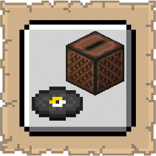

# Jukebox GUI

## Installation

* [Modrinth](https://modrinth.com/mod/jukebox-gui)
* [CurseForge](https://www.curseforge.com/minecraft/mc-mods/jukebox-gui)

## Support
   
If you encounter bugs or wish to contribute:
* [Report any problems you find.](https://github.com/armaninyow/Jukebox-GUI/discussions/categories/issues)
* [Share your ideas for new features.](https://github.com/armaninyow/Jukebox-GUI/discussions/categories/suggestions)

## Changelog

  

   
### 3.0.0—1.21.x
* Added multi-version support covering Minecraft 1.21 through 1.21.11
* Fixed shift+right-clicking a jukebox while holding a placeable block causing a ghost block placement and hotbar flicker
* Replaced local slot highlight PNG files with Minecraft's built-in texture sprites
### 2.0.0—1.21.11
* Updated to Minecraft 1.21.11
### 1.0.0—1.21.10
* Initial Release

